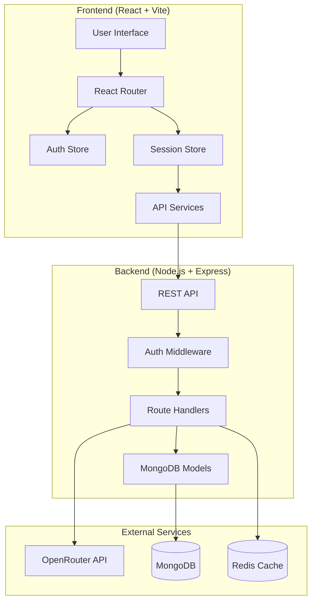

# 🏗️ Architecture Documentation

## System Overview

The Component Generator Platform is a full-stack web application built with a modern, scalable architecture designed for AI-driven component generation with persistent state management.

## Architecture Diagram



## Frontend Architecture

### Component Hierarchy

```
App
├── AuthPages (Login, Signup)
├── ProtectedRoute
    ├── DashboardPage
    │   ├── SessionCard[]
    │   └── CreateSessionModal
    ├── WorkspacePage
    │   ├── ChatInterface
    │   ├── CodeEditor
    │   ├── ComponentPreview
    │   └── PropertyPanel
    └── ProfilePage
```

### State Management (Zustand)

#### Auth Store
```javascript
{
  user: User | null,
  token: string | null,
  isAuthenticated: boolean,
  isLoading: boolean,
  error: string | null,
  // Actions: login, signup, logout, updateProfile
}
```

#### Session Store
```javascript
{
  sessions: Session[],
  currentSession: Session | null,
  chatHistory: ChatMessage[],
  currentCode: { jsx: string, css: string, typescript: boolean },
  uiState: { selectedElement, propertyPanelOpen, activeTab, zoom },
  isLoading: boolean,
  isGenerating: boolean,
  // Actions: CRUD operations, AI generation
}
```

### Data Flow

1. **Authentication Flow**:
   ```
   User Input → Auth Store → API Service → Backend → JWT Token → Persistent Storage
   ```

2. **Session Management Flow**:
   ```
   User Action → Session Store → Auto-save → Backend → MongoDB
   ```

3. **Component Generation Flow**:
   ```
   User Prompt → Session Store → AI Service → OpenRouter → Code Updates → Auto-save
   ```

## Backend Architecture

### Layer Structure

```
Controllers (Route Handlers)
    ↓
Middleware (Auth, Validation, Error Handling)
    ↓
Services (Business Logic)
    ↓
Models (Data Access Layer)
    ↓
Database (MongoDB)
```

### API Design Patterns

#### RESTful Endpoints
- **Resource-based URLs**: `/api/sessions/:id`
- **HTTP methods**: GET, POST, PUT, DELETE
- **Consistent responses**: `{ success, data, message, errors }`
- **Status codes**: 200, 201, 400, 401, 404, 500

#### Authentication Flow
```
Request → JWT Extraction → Token Verification → User Lookup → Route Handler
```

#### Error Handling
```
Error → Error Middleware → Formatted Response → Client
```

## Database Schema Design

### User Model
```javascript
{
  _id: ObjectId,
  email: String (unique, indexed),
  password: String (hashed),
  name: String,
  avatar: String,
  lastLogin: Date,
  isActive: Boolean,
  createdAt: Date,
  updatedAt: Date
}
```

### Session Model
```javascript
{
  _id: ObjectId,
  userId: ObjectId (ref: User, indexed),
  title: String,
  description: String,
  chatHistory: [{
    id: String,
    role: 'user' | 'assistant',
    content: String,
    timestamp: Date,
    images: [String]
  }],
  currentCode: {
    jsx: String,
    css: String,
    typescript: Boolean
  },
  uiState: {
    selectedElement: String,
    propertyPanelOpen: Boolean,
    activeTab: String,
    zoom: Number
  },
  tags: [String],
  isActive: Boolean,
  lastAccessed: Date,
  createdAt: Date,
  updatedAt: Date
}
```

## Security Architecture

### Authentication & Authorization
- **JWT tokens** with 7-day expiration
- **bcrypt hashing** with 12 salt rounds
- **Token refresh** on API calls
- **Role-based access** (user-owned resources only)

### API Security
- **Rate limiting**: 100 requests per 15 minutes
- **CORS configuration**: Restricted origins
- **Input validation**: Joi schemas
- **SQL injection prevention**: Mongoose ODM
- **XSS protection**: Input sanitization

### Data Protection
- **Password hashing**: Never store plain text
- **Token security**: HTTPOnly cookies (planned)
- **Environment variables**: Sensitive data isolation
- **Error handling**: No sensitive data in errors

## Performance Considerations

### Frontend Optimization
- **Code splitting**: Route-based chunks
- **Lazy loading**: Component-level imports
- **Memoization**: React.memo for expensive components
- **Bundle optimization**: Vite treeshaking
- **Image optimization**: WebP format (planned)

### Backend Optimization
- **Database indexing**: User queries and session lookups
- **Connection pooling**: MongoDB connection management
- **Caching strategy**: Redis for session data (planned)
- **Compression**: Gzip middleware
- **CDN integration**: Static asset delivery (planned)

### State Management Optimization
- **Auto-save debouncing**: 2-second delay
- **Selective subscriptions**: Component-specific updates
- **Persistent storage**: Auth state only
- **Memory management**: Cleanup on route changes

## Scalability Design

### Horizontal Scaling
- **Stateless backend**: No server-side sessions
- **Database sharding**: User-based partitioning (planned)
- **Load balancing**: Multiple server instances
- **CDN integration**: Global content delivery

### Vertical Scaling
- **Resource optimization**: Memory and CPU usage
- **Database optimization**: Query performance
- **Caching layers**: Multiple cache levels
- **Background jobs**: Async processing (planned)

## Deployment Architecture

### Development Environment
```
Local Machine
├── Frontend (Vite Dev Server) :5173
├── Backend (Nodemon) :5000
├── MongoDB (Local) :27017
└── Redis (Local) :6379
```

### Production Environment
```
Frontend (Vercel/Netlify)
    ↓ HTTPS
Backend (Render/Railway) 
    ↓ API Calls
MongoDB Atlas (Cloud)
Redis Cloud (Cache)
OpenRouter (AI API)
```

### CI/CD Pipeline (Planned)
1. **Code push** to repository
2. **Automated testing** (unit & integration)
3. **Build process** (frontend & backend)
4. **Deploy to staging** environment
5. **Manual approval** for production
6. **Production deployment** with rollback capability

## Monitoring & Observability

### Logging Strategy
- **Structured logging**: JSON format
- **Log levels**: Error, warn, info, debug
- **Request tracking**: Unique request IDs
- **Performance metrics**: Response times

### Error Tracking
- **Client-side errors**: React error boundaries
- **Server-side errors**: Express error middleware
- **API errors**: Structured error responses
- **User feedback**: Toast notifications

### Analytics (Planned)
- **User behavior**: Session tracking
- **Performance metrics**: Core Web Vitals
- **API usage**: Endpoint analytics
- **Error rates**: Real-time monitoring

## Technology Choices Rationale

### Frontend Stack
- **React**: Component-based architecture, large ecosystem
- **Vite**: Fast development server, optimized builds
- **Zustand**: Lightweight state management, TypeScript support
- **Tailwind CSS**: Utility-first, design consistency
- **Framer Motion**: Smooth animations, declarative API

### Backend Stack
- **Node.js**: JavaScript everywhere, npm ecosystem
- **Express.js**: Mature, lightweight, extensive middleware
- **MongoDB**: Flexible schema, JSON-native storage
- **Mongoose**: ODM with validation and middleware
- **JWT**: Stateless authentication, cross-platform

### External Services
- **OpenRouter**: Multiple AI models, cost-effective pricing
- **MongoDB Atlas**: Managed database, global clusters
- **Vercel/Netlify**: Serverless deployment, edge optimization
- **Redis**: In-memory caching, session storage

## Future Architecture Enhancements

### Phase 2: Real-time Features
- **WebSocket integration**: Live collaboration
- **Server-sent events**: Real-time updates
- **Optimistic updates**: Immediate UI feedback

### Phase 3: Microservices
- **API Gateway**: Centralized routing
- **Service decomposition**: AI, auth, sessions
- **Event-driven architecture**: Async communication

### Phase 4: Advanced Features
- **GraphQL API**: Flexible data fetching
- **Kubernetes deployment**: Container orchestration
- **Multi-tenant architecture**: Enterprise features

---

This architecture provides a solid foundation for the Component Generator Platform with room for future growth and scalability.